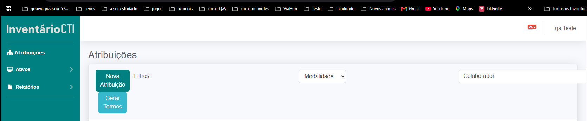
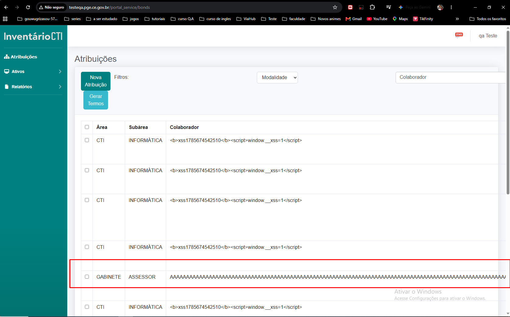
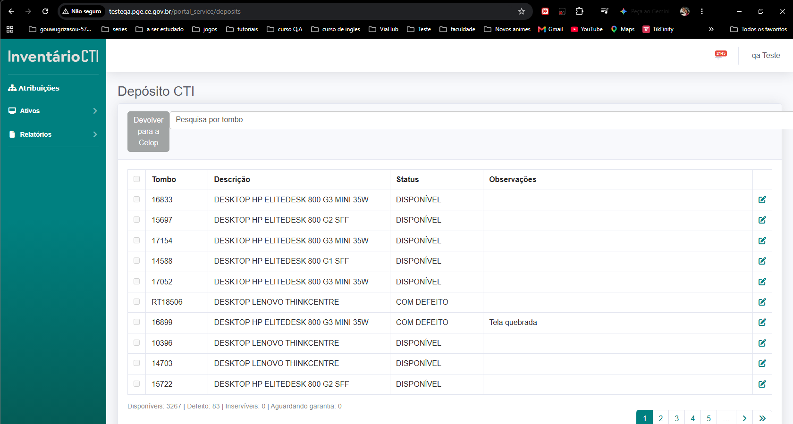
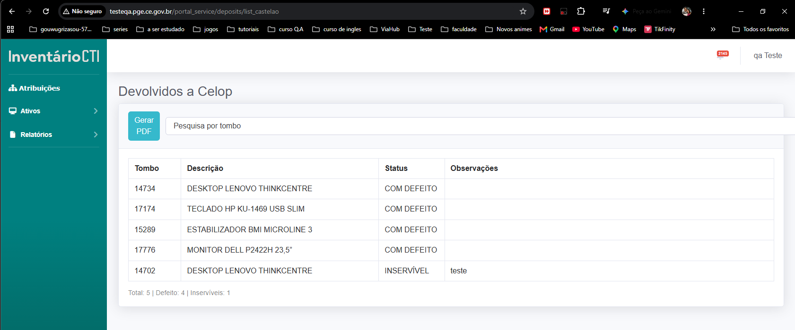
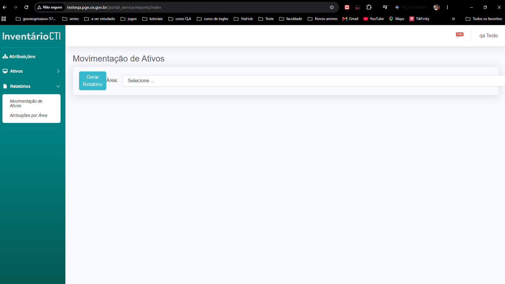
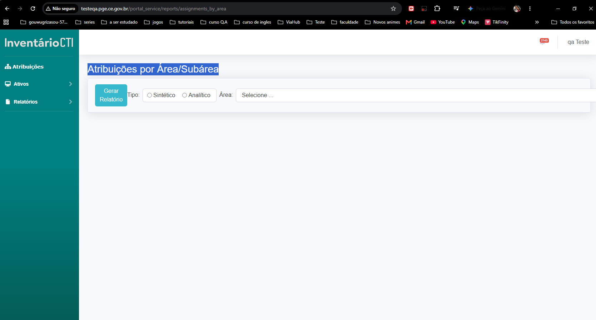

# Relatórios de testes manuais exploratórios

Este documento reúne os resultados dos testes exploratórios realizados manualmente na aplicação. O objetivo é avaliar a experiência do usuário, identificar problemas de interface e validar comportamentos que possam orientar a criação ou o ajuste de testes automatizados.

## TM-001 — Opções de pacote Office não carregam

- **Data:** 2026-10-03
- **Responsável:** Afranio Alcantara
- **Ambiente:** QA
- **Status:** Falhou
- **Severidade:** Média

## Objetivo

Verificar se as opções de pacote Office são carregadas ao preencher uma nova atribuição.

## Pré-condições

- Usuário autenticado como gestor.
- Existe um ativo disponível para atribuição.

## Passos para reproduzir

1. Acessar o cadastro de nova atribuição.
2. Preencher os dados da atribuição presencial para um colaborador.
3. Marcar a opção de pacote Office.

## Resultado esperado

As opções de pacote Office são carregadas e podem ser selecionadas.

## Resultado observado

As opções de pacote Office não são carregadas, impedindo a seleção do pacote.

## Evidência

[Tela sem as opções de pacote Office](image.png)

_________

## TM-002 — pagina de atribuições

- **Data:** 2026-10-03
- **Responsável:** Afranio Alcantara
- **Ambiente:** QA
- **Status:** Falhou
- **Severidade:** Baixa

## Objetivo

Verificar se as paginás tem formatação de layout correta

## Pré-condições

- Usuário autenticado como gestor.

## Passos para reproduzir

1. Acessar o a pagina de atribuições

## Resultado esperado

O alinhamento da pagina deve estar correta apresentando formatação e alinhamento experado.

## Resultado observado
A tela apresenta tela com botões **nova atribuição** e ** gerar termos** desalinhados, apresentando tamanho irregular posicionamento emplilhado, junto o filtro que excede o
limite da tela impossibilitando visualizar as informações completas.

## Evidência

___________

## TM-003 — pagina de atribuições

- **Data:** 2026-10-03
- **Responsável:** Afranio Alcantara
- **Ambiente:** QA
- **Status:** Falhou
- **Severidade:** Baixa

## Objetivo

Verificar se as paginás tem formatação de layout correta

## Pré-condições

- Usuário autenticado como gestor.

## Passos para reproduzir

1. Acessar o a pagina de atribuições

## Resultado esperado

O alinhamento da pagina deve estar correta apresentando formatação e alinhamento experado.

## Resultado observado
A pagina quebra o layout quando o nome do colaborador ultrapassa o limete da pagina ocultando as informaçõe de **Observações**, **Modalidade**, **T.E**, **T.R** e **Ações**

## Evidência

__________

## TM-004 — Seção Devolver para a Celop

- **Data:** 2026-10-03
- **Responsável:** Afranio Alcantara
- **Ambiente:** QA
- **Status:** Falhou
- **Severidade:** Baixa

## Objetivo

Verificar se as paginás tem formatação de layout correta

## Pré-condições

- Usuário autenticado como gestor.

## Passos para reproduzir

1. Clicar no botão toogle da seção ativos
2. Acessar a seção Depósito CTI

## Resultado esperado

O alinhamento da pagina deve estar correta apresentando formatação e alinhamento experado.

## Resultado observado
A tela apresenta tela com botão **Devolver para a Celop** desalinhado, filtro que excede o limite da tela impossibilitando visualizar as informações completas.

## Evidência

___________

## TM-005 — Seção Devolvidos a Celop

- **Data:** 2026-10-03
- **Responsável:** Afranio Alcantara
- **Ambiente:** QA
- **Status:** Falhou
- **Severidade:** Baixa

## Objetivo

Verificar se as paginás tem formatação de layout correta

## Pré-condições

- Usuário autenticado como gestor.

## Passos para reproduzir

1. Clicar no botão toogle da seção ativos
2. Acessar a seção Devolvidos a Celop

## Resultado esperado

O alinhamento da pagina deve estar correta apresentando formatação e alinhamento experado.

## Resultado observado
A tela apresenta tela com botão **Devolver para a Celop** desalinhado, filtro que excede o limite da tela impossibilitando visualizar as informações completas.

## Evidência

_____________

## TM-006 — seção Movimentação de Ativos

- **Data:** 2026-10-03
- **Responsável:** Afranio Alcantara
- **Ambiente:** QA
- **Status:** Falhou
- **Severidade:** Baixa

## Objetivo

Verificar se as paginás tem formatação de layout correta

## Pré-condições

- Usuário autenticado como gestor.

## Passos para reproduzir

1. Clicar no botão toogle da seção Relatórios
2. Acessar a seção Movimentação de Ativos

## Resultado esperado

O alinhamento da pagina deve estar correta apresentando formatação e alinhamento experado.

## Resultado observado
A tela apresenta tela com botão **Gerar relatorio** desalinhado, filtro que excede o limite da tela impossibilitando visualizar as informações completas.

## Evidência

_______

## TM-007 — seção Atribuições por Área/Subárea

- **Data:** 2026-10-03
- **Responsável:** Afranio Alcantara
- **Ambiente:** QA
- **Status:** Falhou
- **Severidade:** Baixa

## Objetivo

Verificar se as paginás tem formatação de layout correta

## Pré-condições

- Usuário autenticado como gestor.

## Passos para reproduzir

1. Clicar no botão toogle da seção Relatórios
2. Acessar a seção Atribuições por Área/Subárea

## Resultado esperado

O alinhamento da pagina deve estar correta apresentando formatação e alinhamento experado.

## Resultado observado
A tela apresenta tela com botão **Gerar relatorio** desalinhado, filtro que excede o limite da tela impossibilitando visualizar as informações completas.

## Evidência
